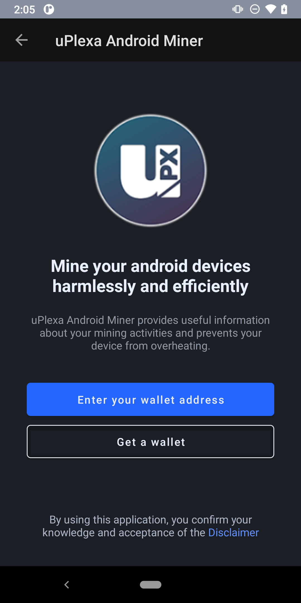
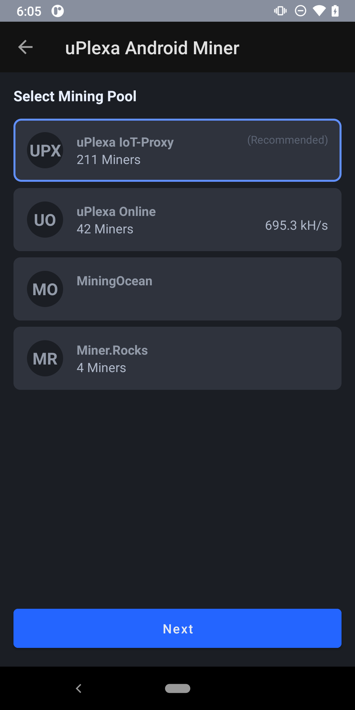

# UPX ANDROID MINER

The first optimized android miner running on a blockchain created for IoT mining (uPlexa).

# Usage

This will currently only work on devices with ARM64 architecture.

Run the app, enter your UPX address, select a pool, start mining!

# Notes

The xmrig binary is copied to the app's internal directory along with its dependent libraries.
(Because it can only be executed there)

The binary is started using the ProcessBuilder class, and the output is captured
into the app's scrolling pane once each secons.

Currently only arm64 binaries are included, and the app will refuse to work on
other architectures like x86 or 32 bit devices.
